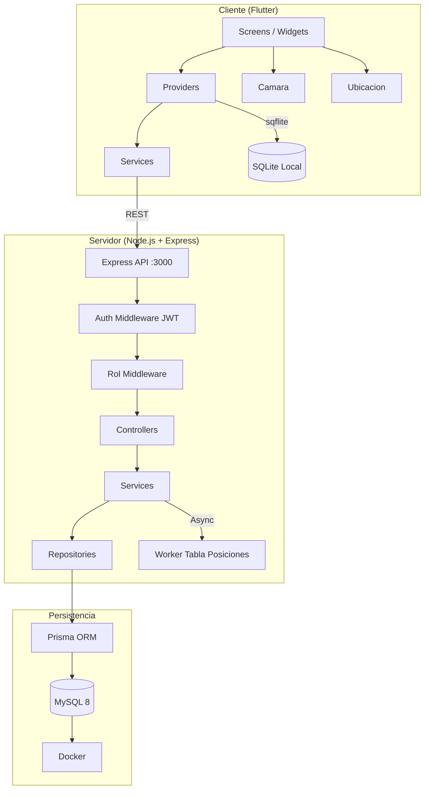
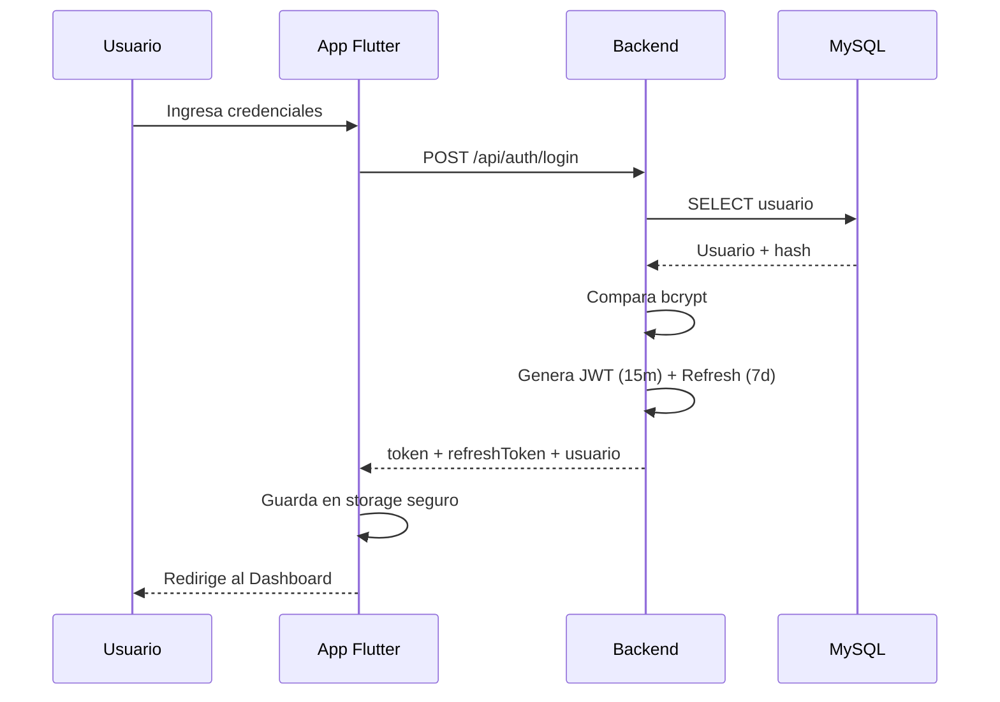
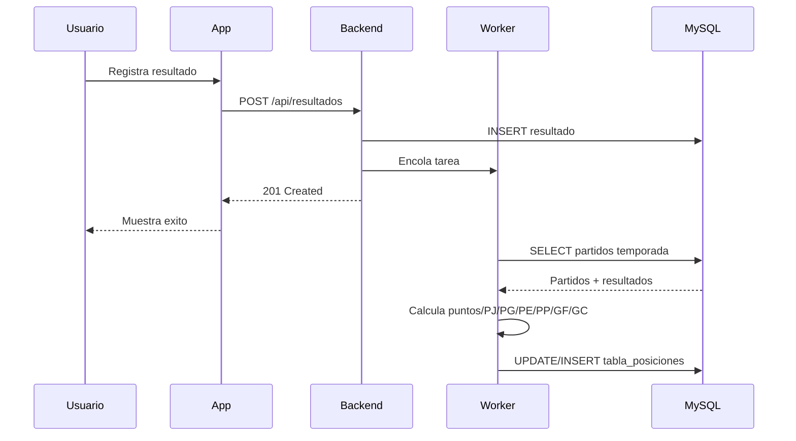

# Liga Deportiva Barrial José Ignacio Izurieta

Proyecto integrador de la asignatura **Aplicaciones Móviles**.

La aplicación tiene como objetivo apoyar la gestión de la Liga Deportiva Barrial José Ignacio Izurieta mediante una arquitectura cliente-servidor. El frontend móvil multiplataforma está desarrollado con Flutter y consume los servicios REST proporcionados por el backend.

---

## 📋 Índice

1. [Tecnologías utilizadas](#1-tecnologías-utilizadas)
2. [Arquitectura](#2-arquitectura)
3. [Framework seleccionado](#3-framework-seleccionado)
4. [Características del entorno](#4-características-del-entorno)
5. [Verificación de Flutter](#5-verificación-de-flutter)
6. [Estructura principal del proyecto](#6-estructura-principal-del-proyecto)
7. [Ejecución del frontend](#7-ejecución-del-frontend)
8. [Recarga en caliente](#8-recarga-en-caliente)
9. [Backend](#9-backend)
10. [Configuración de la API](#10-configuración-de-la-api)
11. [Autenticación y comunicación con la API](#11-autenticación-y-comunicación-con-la-api)
12. [Dependencias principales del frontend](#12-dependencias-principales-del-frontend)
13. [Base de datos](#13-base-de-datos)
14. [Verificación de conectividad](#14-verificación-de-conectividad)
15. [Persistencia local y almacenamiento seguro](#15-persistencia-local-y-almacenamiento-seguro)
16. [Sincronización sin conexión](#16-sincronización-sin-conexión)
17. [Módulos implementados](#17-módulos-implementados)
18. [Limitaciones del entorno](#18-limitaciones-del-entorno)
19. [Control de versiones](#19-control-de-versiones)
20. [Reproducción básica del entorno](#20-reproducción-básica-del-entorno)
21. [Estado del proyecto](#21-estado-del-proyecto)
22. [Interceptores de Dio (Semana 13)](#22-interceptores-de-dio-semana-13)
23. [Funcionalidades nativas (Semana 14)](#23-funcionalidades-nativas-semana-14)
24. [Diagrama de arquitectura](#24-diagrama-de-arquitectura)
25. [Conclusión](#25-conclusión)

---

## 1. Tecnologías utilizadas

### Frontend

| Tecnología             | Versión  | Uso                             |
| ---------------------- | -------- | ------------------------------- |
| Flutter                | 3.44.6   | Framework multiplataforma       |
| Dart                   | 3.12.2   | Lenguaje de programación        |
| Provider               | ^6.1.5+1 | Manejo de estado                |
| Dio                    | ^5.11.0  | Cliente HTTP                    |
| flutter_secure_storage | ^10.3.1  | Almacenamiento seguro de tokens |
| shared_preferences     | ^2.5.5   | Preferencias de usuario         |
| sqflite                | ^2.4.0   | Base de datos local             |
| connectivity_plus      | ^6.1.3   | Detección de conectividad       |
| intl                   | ^0.19.0  | Formato de fechas               |
| jwt_decoder            | ^2.0.1   | Decodificación de JWT           |
| DevTools               | 2.57.0   | Herramientas de desarrollo      |

### Backend

| Tecnología | Versión | Uso                      |
| ---------- | ------- | ------------------------ |
| Node.js    | -       | Entorno de ejecución     |
| TypeScript | ^7.0.2  | Lenguaje de programación |
| Express    | ^5.2.1  | Framework web            |
| Prisma ORM | ^6.19.0 | ORM para base de datos   |
| JWT        | ^9.0.3  | Autenticación            |
| bcryptjs   | ^3.0.3  | Hash de contraseñas      |
| Helmet     | ^8.3.0  | Seguridad HTTP           |
| Morgan     | ^1.11.0 | Logging de solicitudes   |
| Cors       | ^2.8.6  | CORS                     |

### Base de datos

| Tecnología | Versión | Uso                      |
| ---------- | ------- | ------------------------ |
| MySQL      | 8       | Base de datos relacional |
| Docker     | -       | Contenedorización        |

### Herramientas de desarrollo

| Herramienta        | Uso                  |
| ------------------ | -------------------- |
| Visual Studio Code | Editor de código     |
| Android Studio     | IDE para Android     |
| Google Chrome      | Destino de ejecución |
| Git                | Control de versiones |
| GitHub             | Repositorio remoto   |
| Postman/Insomnia   | Pruebas de API       |

---

## 2. Arquitectura

El proyecto utiliza una arquitectura **cliente-servidor** con capas bien definidas:

```text
┌─────────────────────────────────────────────────────────────┐
│                    Aplicación Flutter                       │
│                     (Frontend)                              │
│                                                             │
│  ┌─────────────┐  ┌─────────────┐  ┌─────────────────────┐ │
│  │   Screens   │  │  Providers  │  │   Services (Dio)    │ │
│  │  (UI/UX)    │──│  (Estado)   │──│   (HTTP Client)     │ │
│  └─────────────┘  └─────────────┘  └─────────────────────┘ │
│                                            │                │
│  ┌─────────────────────────────────────────────────────┐    │
│  │              Almacenamiento Local                   │    │
│  │  ┌──────────────┐  ┌────────────────────────────┐  │    │
│  │  │ Secure Store │  │  SQLite (sqflite)          │  │    │
│  │  │ (Tokens)     │  │  (Clubes, Jugadores,       │  │    │
│  │  │              │  │   Operaciones Pendientes)  │  │    │
│  │  └──────────────┘  └────────────────────────────┘  │    │
│  └─────────────────────────────────────────────────────┘    │
│                                            │                │
└────────────────────────────────────────────┼────────────────┘
                                             │
                                             │ HTTP / REST
                                             ▼
┌─────────────────────────────────────────────────────────────┐
│                      API REST Backend                       │
│                    Node.js / Express                        │
│                                                             │
│  ┌─────────────┐  ┌─────────────┐  ┌─────────────────────┐ │
│  │ Controllers │  │  Services   │  │   Middlewares       │ │
│  │ (Rutas)     │──│ (Lógica)    │──│ (Auth, Roles, CORS) │ │
│  └─────────────┘  └─────────────┘  └─────────────────────┘ │
│                                            │                │
└────────────────────────────────────────────┼────────────────┘
                                             │
                                             │ Prisma ORM
                                             ▼
┌─────────────────────────────────────────────────────────────┐
│                        MySQL 8                             │
│                        Docker                              │
│                                                             │
│  ┌─────────────────────────────────────────────────────┐    │
│  │  Usuario │ Club │ Jugador │ Disciplina │ Categoria │    │
│  │  Partido │ Arbitro │ Resultado │ TablaPosiciones │    │
│  └─────────────────────────────────────────────────────┘    │
└─────────────────────────────────────────────────────────────┘
```

---

## 3. Framework seleccionado

Se seleccionó Flutter como framework multiplataforma porque permite desarrollar aplicaciones para diferentes plataformas utilizando una única base de código.

## Para este proyecto, Flutter permite trabajar con Dart y facilita el desarrollo de la interfaz, la integración con servicios HTTP y la ejecución durante las etapas de desarrollo mediante recarga en caliente.

## 4. Características del entorno

El entorno utilizado para el desarrollo corresponde a:

| Componente         | Especificación         |
| ------------------ | ---------------------- |
| Sistema operativo  | Windows 11 Pro 64 bits |
| Versión de Windows | 23H2                   |
| Procesador         | AMD Ryzen 3 3250U      |
| Memoria RAM        | 4 GB                   |
| Flutter            | 3.44.6                 |
| Dart               | 3.12.2                 |
| DevTools           | 2.57.0                 |
| Android SDK        | 36.1.0                 |
| Build Tools        | 36.1.0                 |
| Java               | OpenJDK 21.0.10        |
| Navegador destino  | Google Chrome          |

---

## 5. Verificación de Flutter

Para comprobar la versión instalada se utiliza:

```powershell
flutter --version
```

Para realizar el diagnóstico completo del entorno:

```powershell
flutter doctor -v
```

Para verificar los destinos disponibles:

```powershell
flutter devices
```

El diagnóstico permitió comprobar que Flutter, Windows, Android Toolchain, Chrome y los recursos de red se encuentran disponibles.

Durante el diagnóstico se identificó que Visual Studio no está instalado para el desarrollo de aplicaciones Windows. Esta herramienta no fue necesaria para la demostración realizada, debido a que el destino seleccionado fue Chrome.

---

## 6. Estructura principal del proyecto

```text
liga_deportiva_app/
│
├── backend/
│   ├── prisma/
│   │   ├── migrations/
│   │   ├── schema.prisma
│   │   └── seed.ts
│   ├── src/
│   │   ├── config/
│   │   ├── controllers/
│   │   ├── middlewares/
│   │   ├── repositories/
│   │   ├── routes/
│   │   ├── services/
│   │   ├── workers/
│   │   ├── generated/
│   │   ├── app.ts
│   │   └── server.ts
│   ├── ENDPOINTS.md
│   ├── .env
│   ├── package.json
│   ├── tsconfig.json
│   └── docker-compose.yml
│
├── frontend/
│   ├── lib/
│   │   ├── config/
│   │   │   └── api_config.dart
│   │   ├── database/
│   │   │   ├── database_helper.dart
│   │   │   └── app_dao.dart
│   │   ├── forms/
│   │   │   └── formulario_jugador.dart
│   │   ├── models/
│   │   ├── providers/
│   │   ├── screens/
│   │   │   ├── auth/
│   │   │   ├── clubes/
│   │   │   ├── jugadores/
│   │   │   ├── disciplinas/
│   │   │   ├── categorias/
│   │   │   ├── arbitros/
│   │   │   ├── temporadas/
│   │   │   ├── partidos/
│   │   │   ├── resultados/
│   │   │   ├── tabla_posiciones/
│   │   │   └── dashboard/
│   │   ├── services/
│   │   ├── theme/
│   │   ├── widgets/
│   │   └── main.dart
│   │
│   ├── android/
│   ├── ios/
│   ├── web/
│   ├── windows/
│   ├── pubspec.yaml
│   └── test/
│
├── docs/
├── .vscode/
├── .gitignore
├── CONTEXTO_PROYECTO.md
└── README.md
```

---

## 7. Ejecución del frontend

Para ejecutar el proyecto Flutter:

```powershell
cd frontend
flutter run -d chrome
```

Para ejecutar en el dispositivo físico:

```powershell
cd frontend
flutter run -d <device-id>
```

También se puede utilizar:

```powershell
flutter devices
```

El comando anterior permite consultar los destinos disponibles.

Durante la demostración se utilizó Google Chrome y el dispositivo físico Infinix X6827 como destinos de ejecución.

La elección de Chrome permitió ejecutar y verificar la aplicación rápidamente, mientras que el dispositivo físico permitió probar las funcionalidades nativas (cámara y ubicación).

---

## 8. Recarga en caliente

Flutter permite utilizar Hot Reload durante el desarrollo.

La recarga en caliente permite observar cambios realizados en el código sin tener que reiniciar completamente la aplicación, facilitando el desarrollo y las pruebas de la interfaz.

**Atajos de teclado:**

- `r` → Hot Reload
- `R` → Hot Restart
- `q` → Salir

---

## 9. Backend

El backend se ejecuta mediante Node.js.

Para iniciar el servidor:

```powershell
cd backend
npm run dev
```

El servidor queda disponible en:

```text
http://localhost:3000
```

Para acceso desde otros dispositivos en la misma red, el servidor escucha en 0.0.0.0:

```text
http://192.168.x.x:3000
```

El backend proporciona además un endpoint de comprobación:

```text
http://localhost:3000/health
```

Una respuesta correcta del endpoint es:

```json
{
  "status": "OK",
  "message": "Servidor funcionando correctamente",
  "timestamp": "..."
}
```

Endpoints principales del backend:

- Health check: `GET /health`
- Swagger UI: `GET /api-docs`
- API REST: `/api/*`

El catálogo completo de endpoints se encuentra documentado en [backend/ENDPOINTS.md](backend/ENDPOINTS.md).

---

## 10. Configuración de la API

La URL base utilizada por el frontend se encuentra definida en:

```text
frontend/lib/config/api_config.dart
```

Configuración utilizada durante el desarrollo:

```dart
class ApiConfig {
  static const String _defaultApiUrl = 'http://192.168.1.8:3000/api';
  static const String _defaultEnvironment = 'dev';

  static const String apiUrl = String.fromEnvironment(
    'API_URL',
    defaultValue: _defaultApiUrl,
  );

  static const String environment = String.fromEnvironment(
    'ENVIRONMENT',
    defaultValue: _defaultEnvironment,
  );

  static bool get isDevelopment => environment == 'dev';
  static bool get isProduction => environment == 'prod';

  static const Duration connectTimeout = Duration(seconds: 10);
  static const Duration receiveTimeout = Duration(seconds: 15);
  static const Duration sendTimeout = Duration(seconds: 15);

  static bool get enableLogs => isDevelopment;
}
```

La dirección localhost o la IP de la red local corresponde al equipo donde se encuentra ejecutándose el backend.

### Configuración desde línea de comandos

Se puede sobrescribir la URL al ejecutar la aplicación sin modificar el código:

```powershell
flutter run --dart-define=API_URL=http://192.168.1.8:3000/api
```

Esta configuración corresponde al entorno de desarrollo local y debe modificarse cuando la aplicación se despliegue en un entorno diferente.

---

## 11. Autenticación y comunicación con la API

La aplicación utiliza autenticación JWT para acceder a los recursos protegidos del backend.

El frontend almacena el token de autenticación mediante `flutter_secure_storage` y lo envía en las solicitudes protegidas mediante el encabezado:

```text
Authorization: Bearer <token>
```

### Flujo de autenticación

1. El usuario ingresa sus credenciales en la pantalla de login.
2. El frontend envía `POST /api/auth/login`.
3. El backend valida las credenciales y devuelve el token, el refresh token y los datos del usuario.
4. El frontend guarda el token en almacenamiento seguro.
5. El `AuthInterceptor` inyecta el token en cada solicitud protegida.

### Verificación del entorno

Durante la verificación del entorno se comprobó la autenticación mediante `POST /api/auth/login`, que devolvió `200 OK`.

Posteriormente se verificó el acceso al recurso de clubes mediante `GET /api/clubes`, que también devolvió `200 OK`.

Esto permitió comprobar que la aplicación Flutter puede comunicarse correctamente con el backend propio del proyecto.

---

## 12. Dependencias principales del frontend

Entre las dependencias utilizadas se encuentran:

| Paquete                  | Versión  | Función                                    |
| ------------------------ | -------- | ------------------------------------------ |
| `dio`                    | ^5.11.0  | Cliente HTTP para solicitudes a la API     |
| `provider`               | ^6.1.5+1 | Administración del estado de la aplicación |
| `flutter_secure_storage` | ^10.3.1  | Almacenamiento seguro del token            |
| `sqflite`                | ^2.4.0   | Base de datos local SQLite                 |
| `connectivity_plus`      | ^6.1.3   | Detección de conectividad                  |
| `shared_preferences`     | ^2.5.5   | Preferencias de usuario                    |
| `jwt_decoder`            | ^2.0.1   | Decodificación de JWT                      |
| `image_picker`           | ^1.1.2   | Captura de fotos con la cámara             |
| `geolocator`             | ^13.0.1  | Geolocalización GPS                        |
| `permission_handler`     | ^11.3.1  | Manejo de permisos nativos                 |
| `json_serializable`      | ^6.8.0   | Serialización JSON                         |

Estas dependencias se encuentran registradas en:

```text
frontend/pubspec.yaml
```

---

## 13. Base de datos

La aplicación utiliza **MySQL 8** como sistema de gestión de base de datos.

La base de datos se ejecuta mediante **Docker** durante el desarrollo.

El backend utiliza **Prisma ORM** para interactuar con la base de datos.

### Modelos de la base de datos

```prisma
model Usuario { ... }
model Club { ... }
model Jugador { ... }
model Disciplina { ... }
model Categoria { ... }
model Temporada { ... }
model Arbitro { ... }
model Partido { ... }
model Resultado { ... }
model TablaPosiciones { ... }
model JugadorDisciplina { ... }
```

### Arquitectura de la base de datos

```text
Flutter
   ↓
API REST
   ↓
Prisma ORM
   ↓
MySQL
   ↓
Docker
```

### Índices de base de datos

Se implementaron índices en los modelos de Prisma para optimizar las consultas frecuentes:

- Usuario: índice en `rol`.
- Club: índice en `ciudad`.
- Jugador: índices en `id_club`, `nombre` y `fecha_nacimiento`.
- Categoria: índices en `id_disciplina` y `nombre`.
- Arbitro: índices en `nombre` y `categoria`.
- Partido: índices en `fecha`, `id_categoria`, `id_club_local`, `id_club_visitante`, `id_temporada`, `id_arbitro` y `programado_por`.
- Resultado: índice en `registrado_por`.
- JugadorDisciplina: índice en `id_disciplina`.
- TablaPosiciones: índices en `id_club` y `puntos`.

## 14. Verificación de conectividad

La conectividad fue comprobada en dos niveles.

### Health Check

```text
GET /health
```

Resultado:

```text
200 OK
```

### API protegida

La autenticación se comprobó mediante `POST /api/auth/login`, que devolvió `200 OK`.

Posteriormente, el acceso al recurso protegido `GET /api/clubes` también devolvió `200 OK`.

La evidencia confirma que el frontend puede autenticarse y consumir un endpoint del backend propio.

---

## 15. Persistencia local y almacenamiento seguro

### 15.1 Almacenamiento seguro de credenciales

Los tokens de autenticación se almacenan en `flutter_secure_storage`, que utiliza:

- **iOS:** Keychain (llavero)
- **Android:** Keystore (almacén de claves)

Esto garantiza que los tokens estén cifrados y protegidos contra accesos no autorizados.

```dart
// Ejemplo de almacenamiento seguro
final storage = FlutterSecureStorage();
await storage.write(key: 'token', value: token);
final token = await storage.read(key: 'token');
await storage.delete(key: 'token'); // Al cerrar sesión
```

### 15.2 Base de datos local (sqflite)

La aplicación utiliza SQLite como base de datos local con las siguientes tablas:

| Tabla                    | Función                                    |
| ------------------------ | ------------------------------------------ |
| `clubes`                 | Almacena clubes localmente                 |
| `jugadores`              | Almacena jugadores localmente              |
| `disciplinas`            | Almacena disciplinas localmente            |
| `categorias`             | Almacena categorías localmente             |
| `arbitros`               | Almacena árbitros localmente               |
| `temporadas`             | Almacena temporadas localmente             |
| `partidos`               | Almacena partidos localmente               |
| `resultados`             | Almacena resultados localmente             |
| `tabla_posiciones`       | Almacena la tabla de posiciones localmente |
| `operaciones_pendientes` | Cola de sincronización                     |

### 15.3 Campos de control de sincronización

Cada tabla incluye campos de control:

| Campo                   | Función                                  |
| ----------------------- | ---------------------------------------- |
| `pendiente_envio`       | Indica si el registro debe sincronizarse |
| `eliminado_local`       | Indica si fue eliminado localmente       |
| `ultima_sincronizacion` | Fecha de última sincronización           |
| `id_unico_cliente`      | UUID para idempotencia                   |

---

## 16. Sincronización sin conexión

### 16.1 Estrategia implementada

Se implementó una estrategia de **escritura diferida en cola**:

| Característica | Descripción                                      |
| -------------- | ------------------------------------------------ |
| Funcionamiento | Los cambios se registran localmente y se encolan |
| Sincronización | Automática al recuperar conexión                 |
| Reintentos     | Backoff exponencial (2s, 4s, 8s, 16s, 32s)       |
| Idempotencia   | UUID para evitar duplicados                      |

### 16.2 Flujo de sincronización

```text
1. Usuario ejecuta acción (crear/editar/eliminar)
   ↓
2. Verificar conectividad
   ↓
3. Si hay conexión → Enviar al servidor
   ↓
4. Si NO hay conexión → Guardar en BD local + Cola
   ↓
5. Al recuperar conexión → Sincronizar automáticamente
   ↓
6. Reintentos con backoff si falla
```

### 16.3 Reintentos y backoff

| Intento | Tiempo de espera |
| ------- | ---------------- |
| 1       | 2 segundos       |
| 2       | 4 segundos       |
| 3       | 8 segundos       |
| 4       | 16 segundos      |
| 5 o más | 32 segundos      |

### 16.4 Detección de conectividad

La aplicación utiliza un BackendChecker que verifica si el backend responde antes de decidir si guarda local o remoto. Esto permite un manejo preciso del modo offline incluso cuando el dispositivo reporta una conexión de red activa.

---

## 17. Módulos implementados

| Módulo                  | Estado        | Funcionalidades                                          |
| ----------------------- | ------------- | -------------------------------------------------------- |
| **Autenticación**       | ✅ Completado | Login, logout, token JWT, refresh token                  |
| **Usuarios**            | ✅ Completado | CRUD completo (requiere SUPER_ADMIN)                     |
| **Clubes**              | ✅ Completado | CRUD completo + sincronización offline + ubicación GPS   |
| **Jugadores**           | ✅ Completado | CRUD completo + sincronización offline + foto con cámara |
| **Disciplinas**         | ✅ Completado | CRUD completo                                            |
| **Categorías**          | ✅ Completado | CRUD completo + relación con Disciplina                  |
| **Árbitros**            | ✅ Completado | CRUD completo                                            |
| **Temporadas**          | ✅ Completado | CRUD completo                                            |
| **Partidos**            | ✅ Completado | CRUD completo + 5 dropdowns relacionales                 |
| **Resultados**          | ✅ Completado | CRUD completo + dispara cálculo automático               |
| **Tabla de posiciones** | ✅ Completado | Cálculo automático + CRUD manual                         |
| **Jugador-Disciplina**  | ✅ Completado | Relación N:M                                             |

### Credenciales de prueba

| Campo          | Valor            |
| -------------- | ---------------- |
| **Correo**     | `admin@liga.com` |
| **Contraseña** | `654321`         |
| **Rol**        | `SUPER_ADMIN`    |

---

## 18. Limitaciones del entorno

### Limitación 1: memoria disponible

El equipo dispone de 4 GB de memoria RAM. La ejecución simultánea de Flutter, el backend, Docker y herramientas adicionales puede generar un consumo considerable de recursos.

Como estrategia de mitigación se utilizó Google Chrome y el dispositivo físico como destinos de ejecución, evitando depender de un emulador Android durante la demostración.

### Limitación 2: desarrollo para Windows

El diagnóstico `flutter doctor -v` reportó que Visual Studio no está instalado para el desarrollo de aplicaciones Windows.

Esta limitación no afecta la demostración realizada porque el destino seleccionado fue Chrome y el entorno Android se encuentra configurado.

### Limitación 3: conectividad entre dispositivos

Para probar en dispositivos físicos, el backend debe escuchar en `0.0.0.0` y el firewall debe permitir el puerto 3000.

### Limitación 4: Flutter Web

Algunas funcionalidades nativas (cámara, ubicación, permisos) **no funcionan en Flutter Web** porque dependen de APIs del sistema operativo. Solo funcionan en dispositivos físicos Android/iOS.

---

## 19. Control de versiones

El proyecto utiliza Git para el control de versiones y GitHub como repositorio remoto.

Repositorio:

```text
https://github.com/lams1474/liga_deportiva_app
```

El repositorio contiene:

- Frontend Flutter
- Backend Node.js/Express
- Estructura de base de datos (Prisma)
- Documentación
- Configuración del proyecto
- Catálogo de endpoints (`ENDPOINTS.md`)
- Contexto del proyecto (`CONTEXTO_PROYECTO.md`)

---

## 20. Reproducción básica del entorno

Para reproducir el proyecto se recomienda seguir estos pasos:

### Paso 1 — Obtener el repositorio

```powershell
git clone https://github.com/lams1474/liga_deportiva_app.git
cd liga_deportiva_app
```

### Paso 2 — Preparar el frontend

```powershell
cd frontend
flutter pub get
```

### Paso 3 — Verificar Flutter

```powershell
flutter doctor -v
```

### Paso 4 — Configurar la base de datos

```powershell
cd ../backend
docker-compose up -d
npx prisma migrate dev
npx prisma db seed
```

### Paso 5 — Iniciar el backend

```powershell
npm run dev
```

### Paso 6 — Ejecutar Flutter

```powershell
cd ../frontend
flutter run -d chrome
```

O en dispositivo físico:

```powershell
flutter run -d <device-id>
```

### Paso 7 — Comprobar el backend

Abrir en el navegador:

```text
http://localhost:3000/health
```

La respuesta debe indicar que el servidor está funcionando correctamente.

### Paso 8 — Probar la aplicación

1. Iniciar sesión con las credenciales de prueba indicadas en la sección de módulos.
2. Navegar entre módulos.
3. Probar la creación, edición y eliminación de registros.
4. Probar la cámara y la ubicación (solo en dispositivo físico).
5. Probar el modo avión y la sincronización.

---

## 21. Estado del proyecto

El proyecto se encuentra **completado** en su alcance funcional.

### ✅ Completado

- Configuración del entorno multiplataforma
- Autenticación JWT con refresh
- CRUD completo de 11 módulos
- Almacenamiento seguro de tokens
- Persistencia local (sqflite)
- Sincronización automática sin conexión
- Cola de operaciones pendientes
- Cámara y ubicación (dispositivo físico)
- Degradación elegante de permisos
- Cálculo automático de tabla de posiciones
- Documentación Swagger
- Catálogo de endpoints

### 🔲 Pendiente / Mejoras futuras

- Módulo de Acta de Juego (PDF con alineaciones, goles, tarjetas)
- Tabla de goleadores
- Pruebas automatizadas con `flutter_test`
- Notificaciones push
- Despliegue en producción

---

## 22. Interceptores de Dio (Semana 13)

Se implementaron **4 interceptores** en el siguiente orden:

| #   | Interceptor          | Momento         | Responsabilidad                                   |
| --- | -------------------- | --------------- | ------------------------------------------------- |
| 1   | `AuthInterceptor`    | Antes de enviar | Inyecta el token JWT en el header `Authorization` |
| 2   | `RefreshInterceptor` | Ante un 401     | Renueva el token y reintenta la petición          |
| 3   | `LogInterceptor`     | Antes/después   | Registra peticiones (solo en desarrollo)          |
| 4   | `ErrorInterceptor`   | Ante un error   | Traduce errores a mensajes del dominio            |

### Flujo de renovación de token

```text
1. Petición → 401 (token expirado)
2. RefreshInterceptor detecta el 401
3. Solicita nuevo token a POST /auth/refresh
4. Guarda el nuevo token
5. Reintenta la petición original
6. Si el refresh falla → cierra sesión
```

---

## 23. Funcionalidades nativas (Semana 14)

Se incorporaron **dos capacidades nativas** del dispositivo, con manejo completo de los cuatro estados de permiso (incluida la denegación permanente) y degradación elegante ante la indisponibilidad.

### 23.1 Capacidades seleccionadas

| #   | Capacidad     | Plugin                | Tipo     | Justificación                                                                                                         |
| --- | ------------- | --------------------- | -------- | --------------------------------------------------------------------------------------------------------------------- |
| 1   | **Cámara**    | `image_picker ^1.1.2` | Esencial | Permite capturar la foto del jugador al momento del registro, requisito para la identificación visual del deportista. |
| 2   | **Ubicación** | `geolocator ^13.0.1`  | Opcional | Registra las coordenadas del club deportivo para ubicarlo geográficamente en el mapa de la liga.                      |

### 23.2 Verificación de plugins

| Plugin               | Pub.dev       | Plataformas                | Mantenido por |
| -------------------- | ------------- | -------------------------- | ------------- |
| `image_picker`       | ✅ Verificado | Android, iOS, Web, Desktop | Flutter Team  |
| `geolocator`         | ✅ Verificado | Android, iOS, Web, Desktop | Baseflow      |
| `permission_handler` | ✅ Verificado | Android, iOS               | Baseflow      |

Criterios aplicados:

- Publicados y verificados en pub.dev
- Mantenidos activamente (última actualización < 6 meses)
- Compatibles con las plataformas objetivo del proyecto
- Ampliamente adoptados en la comunidad Flutter

### 23.3 Permisos declarados

#### Android (`android/app/src/main/AndroidManifest.xml`)

| Permiso                                     | Propósito                                       |
| ------------------------------------------- | ----------------------------------------------- |
| `android.permission.CAMERA`                 | Tomar la foto del jugador al registrarlo        |
| `android.permission.ACCESS_FINE_LOCATION`   | Obtener ubicación precisa del club deportivo    |
| `android.permission.ACCESS_COARSE_LOCATION` | Obtener ubicación aproximada del club deportivo |

Además se declara la query de `IMAGE_CAPTURE` requerida por `image_picker` en Android 11+.

#### iOS (`ios/Runner/Info.plist`)

| Clave                                 | Cadena de propósito                                                                                                 |
| ------------------------------------- | ------------------------------------------------------------------------------------------------------------------- |
| `NSCameraUsageDescription`            | "La Liga Deportiva necesita acceso a la cámara para tomar la foto del jugador al momento de registrarlo."           |
| `NSLocationWhenInUseUsageDescription` | "La Liga Deportiva usa tu ubicación para registrar la ubicación del club deportivo mientras usas la aplicación."    |
| `NSPhotoLibraryUsageDescription`      | "La Liga Deportiva necesita acceso a tus fotos para que puedas escoger una imagen existente como foto del jugador." |

### 23.4 Los cuatro estados de un permiso

Implementados en `lib/services/permission_service.dart` mediante el enum `PermissionResult`:

| Estado              | Cuándo ocurre                                        | Comportamiento de la app                                                                  |
| ------------------- | ---------------------------------------------------- | ----------------------------------------------------------------------------------------- |
| `granted`           | El usuario concede el permiso                        | Se ejecuta la funcionalidad normalmente                                                   |
| `denied`            | El usuario deniega una vez                           | SnackBar naranja: "Para tomar la foto necesitas permitir el acceso a la cámara."          |
| `permanentlyDenied` | El usuario deniega y marca "no volver a preguntar"   | Diálogo con botón **"Abrir Ajustes"** que ejecuta `openAppSettings()`                     |
| `serviceDisabled`   | El GPS del dispositivo está apagado (solo ubicación) | Diálogo con botón **"Activar ubicación"** que ejecuta `Geolocator.openLocationSettings()` |

### 23.5 Matriz de degradación

| Capacidad | Estado                 | Comportamiento de la app                       | Acción del usuario            |
| --------- | ---------------------- | ---------------------------------------------- | ----------------------------- |
| Cámara    | Concedido              | Abre la cámara del sistema                     | —                             |
| Cámara    | Denegado               | SnackBar informativo, sin crash                | Puede reintentar              |
| Cámara    | Denegación permanente  | Diálogo → Ajustes del sistema                  | Habilita desde Ajustes        |
| Cámara    | Ausente                | `ImagePicker` no abre, la app continúa         | Usa "Escoger" o deja sin foto |
| Ubicación | Concedido + GPS activo | Obtiene coordenadas con precisión              | —                             |
| Ubicación | Denegado               | SnackBar informativo                           | Puede reintentar              |
| Ubicación | Denegación permanente  | Diálogo → Ajustes del sistema                  | Habilita desde Ajustes        |
| Ubicación | GPS apagado            | Diálogo → Ajustes de ubicación del dispositivo | Activa el GPS                 |

### 23.6 Integración con persistencia local y backend

- **Foto del jugador**:
  - Se copia de la caché temporal a `getApplicationDocumentsDirectory()/fotos_jugadores/`
  - La ruta se persiste en SQLite local (`jugadores.foto_path`)
  - La ruta se envía al backend MySQL (`Jugador.foto_path`) mediante `POST /api/jugadores`
- **Ubicación del club**:
  - Se guarda en SQLite local (`clubes.latitud`, `clubes.longitud`, `clubes.precision_ubicacion`)
  - Se envía al backend MySQL (`Club.latitud`, `Club.longitud`, `Club.precision_ubicacion`)
- **Sincronización offline**:
  - Si el backend no responde (`BackendChecker.estaDisponible()` retorna `false`), la operación se encola en la tabla `operaciones_pendientes`
  - Al recuperar conexión, `SyncProvider` reintenta automáticamente con backoff exponencial
  - Esto mantiene compatibilidad con la estrategia implementada en la Semana 12

### 23.7 Solicitud en el momento de uso

Los permisos **NO** se solicitan al iniciar la aplicación. Se solicitan cuando el usuario ejecuta una acción concreta:

| Acción del usuario                                 | Permiso solicitado                                                                              |
| -------------------------------------------------- | ----------------------------------------------------------------------------------------------- |
| Tocar "Tomar foto" en el formulario de jugador     | `Permission.camera`                                                                             |
| Tocar "Obtener ubicación" en el formulario de club | `Permission.locationWhenInUse` + verificación previa de `Geolocator.isLocationServiceEnabled()` |

Antes de cada solicitud, la app verifica el estado actual del permiso. Si el usuario deniega, muestra un SnackBar informativo. Si deniega permanentemente, muestra un diálogo con acceso directo a los ajustes del sistema.

### 23.8 Cumplimiento de la tienda

| Aspecto                                                   | Estado                                                      |
| --------------------------------------------------------- | ----------------------------------------------------------- |
| `targetSdk`                                               | 36 (Android 16) ✅                                          |
| `compileSdk`                                              | 36 (Android 16) ✅                                          |
| `minSdk`                                                  | definido por Flutter (21+)                                  |
| Permisos de acceso amplio innecesarios                    | ❌ Ninguno                                                  |
| Ubicación en segundo plano (`ACCESS_BACKGROUND_LOCATION`) | ❌ No se solicita                                           |
| Acceso a galería con permiso amplio (`READ_MEDIA_IMAGES`) | ❌ No se declara — se usa el selector del sistema           |
| `NSPhotoLibraryUsageDescription`                          | ✅ Se declara solo porque se permite escoger foto existente |

Se revisó el nivel de API objetivo considerando la política vigente de Google Play (a partir del 31 de agosto de 2026, las aplicaciones nuevas deben apuntar a Android 16 / API 36).

### 23.9 Pruebas en dispositivo físico

**Dispositivo:** Infinix X6827 (Android 14)

| #   | Caso                            | Resultado                                                                                   |
| --- | ------------------------------- | ------------------------------------------------------------------------------------------- |
| 1   | Permiso concedido               | ✅ Foto capturada y ubicación registrada; datos persistidos en SQLite y enviados al backend |
| 2   | Permiso denegado                | ✅ SnackBar informativo, la app continúa funcionando                                        |
| 3   | Denegación permanente           | ✅ Diálogo con botón "Abrir Ajustes" que ejecuta `openAppSettings()`                        |
| 4   | Permiso revocado en vivo        | ✅ La app detecta el estado real al reintentar y aplica la degradación                      |
| 5   | Capacidad ausente (GPS apagado) | ✅ Diálogo con botón "Activar ubicación" que ejecuta `Geolocator.openLocationSettings()`    |

Nota: cuando se cambia un permiso desde Ajustes del sistema, Android reinicia el proceso de la aplicación. Este comportamiento es normal del sistema operativo y no representa un fallo de la app.

### 23.10 Archivos relevantes

| Archivo                                      | Propósito                                                               |
| -------------------------------------------- | ----------------------------------------------------------------------- |
| `lib/services/permission_service.dart`       | Servicio centralizado con el enum `PermissionResult` y los 4 estados    |
| `lib/services/foto_service.dart`             | Copia la foto de la caché temporal al directorio permanente de la app   |
| `lib/services/backend_checker.dart`          | Verifica si el backend responde antes de decidir guardar local o remoto |
| `lib/forms/formulario_jugador.dart`          | Integración de cámara en el formulario de jugador                       |
| `lib/screens/clubes/crear_club_screen.dart`  | Integración de ubicación al crear club                                  |
| `lib/screens/clubes/editar_club_screen.dart` | Integración de ubicación al editar club                                 |
| `lib/database/database_helper.dart`          | Versión 2 de la BD local con columnas de ubicación y foto               |
| `android/app/src/main/AndroidManifest.xml`   | Declaración de permisos Android                                         |
| `ios/Runner/Info.plist`                      | Cadenas de propósito iOS                                                |

---

## 24. Diagrama de arquitectura

### 24.1 Vista general



### 24.2 Flujo de autenticación



### 24.3 Cálculo automático de tabla de posiciones



---

## 25. Conclusión

La configuración realizada permite disponer de un entorno funcional para el desarrollo de la aplicación móvil multiplataforma de la Liga Deportiva Barrial José Ignacio Izurieta.

Se verificaron las versiones del framework, el diagnóstico del entorno, la ejecución del proyecto Flutter, la recarga en caliente y la comunicación con el backend propio mediante la API REST.

Se implementaron funcionalidades avanzadas como:

- Almacenamiento seguro de tokens con `flutter_secure_storage`.
- Persistencia local con `sqflite`.
- Sincronización automática con `connectivity_plus`.
- Cola de operaciones pendientes con reintentos.
- Cámara y ubicación con degradación elegante de permisos.
- Cálculo automático de la tabla de posiciones mediante un worker.
- Documentación Swagger completa.
- Catálogo de endpoints en `ENDPOINTS.md`.

La documentación permite identificar las herramientas, versiones, comandos y configuraciones principales utilizadas durante el desarrollo.

---

## 📝 Autor

| Campo           | Información                                    |
| --------------- | ---------------------------------------------- |
| **Autor**       | LAMS1474                                       |
| **Asignatura**  | Aplicaciones Móviles                           |
| **Proyecto**    | Liga Deportiva Barrial José Ignacio Izurieta   |
| **Repositorio** | https://github.com/lams1474/liga_deportiva_app |

---

## 📅 Fecha

Septiembre 2026
